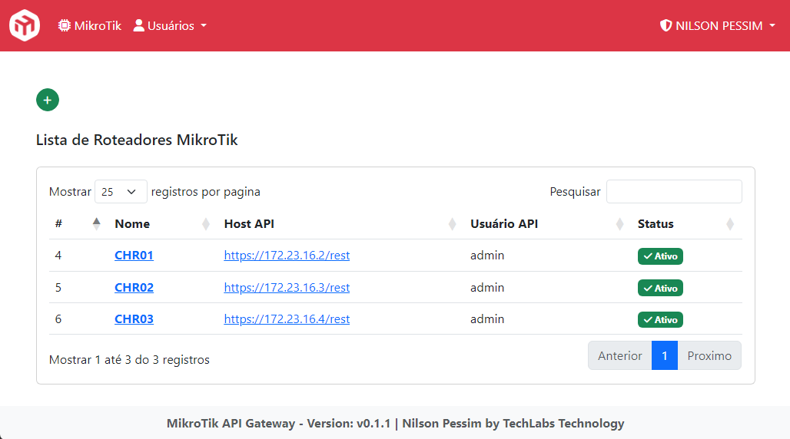
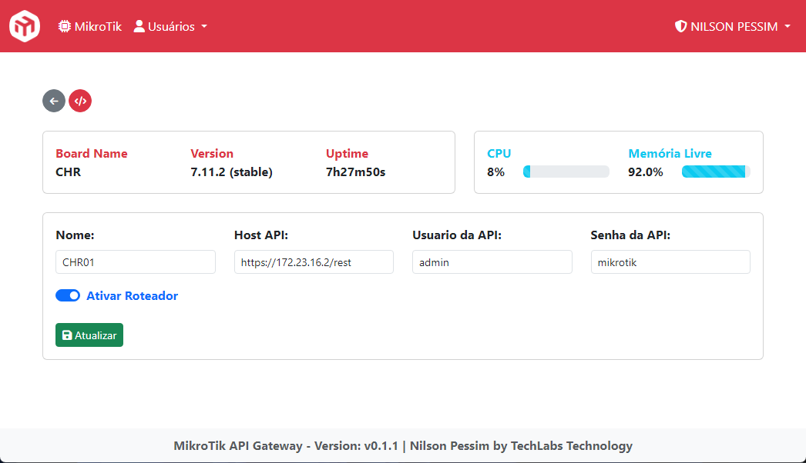

---

**API Gateway** é um sistema de gerenciamento centralizado para MikroTik RouterOS, utilizando a API REST, ele trabalha como um INTERMEDIÁRIO, recebendo as requisições de uma fonte externa e encaminhando para o seu roteador MikroTik.

* Requer um Servidor Web com MySQL e PHP Versão 8.2+
* A API REST da MikroTik está disponível à partir da versão **v7.1beta4** do RouterOS.

**Versão 0.1.2**

#### Video de Apresentação

[](https://www.youtube.com/watch?v=kpnmU89GQNM)

---

#### Confira todos os Releases
https://github.com/nilsonpessim/mikrotik-api-gateway/releases

* Baixe sempre a última versão disponível.
---

#### Sugestão de melhorias
https://github.com/nilsonpessim/mikrotik-api-gateway/pulls

* Para sugestões de melhorias e funcionalidades no código, abra um [PULL REQUEST](https://github.com/nilsonpessim/mikrotik-api-gateway/pulls) diretamente no GitHub.

---

#### Acesse a documentação
https://github.com/nilsonpessim/mikrotik-api-gateway/wiki

* Em caso de dúvidas, abra um [ISSUE](https://github.com/nilsonpessim/mikrotik-api-gateway/issues) diretamente no GitHub.
* Leia sempre o nosso Changelog.

---

### Capturas de Tela - Acesso API WEB





---

### :wrench: Configurações do Roteador
 
#### Configurar certificado digital SSL

À partir da versão **7.9** do RouterOS, não é obrigado o certificado SSL para consumir a API REST, podendo ser acessado com **http://{ip}/rest**, utilizando o serviço *www* porta 80.

Em ambiente de produção, recomendamos fortemente o uso do serviço *www-ssl* porta 443. Segue um link de como gerar um certificado SSL para usar na API, diretamente da WiKi da MikroTik: https://help.mikrotik.com/docs/display/ROS/Certificates


#### Configurar usuário para comunicação API

* É necessário configurar um usuário no roteador, para comunicar com a API.
* Vamos criar um grupo com as suas devidas permissões, e atribuir o usuário a este grupo.
* Você também pode restringir o acesso API, informando o IP do seu servidor como origem do acesso, isso irá garantir mais segurança ao seu roteador.

```
/user group
add name=api policy="read,write,api,rest-api,!local,!telnet,!ssh,!ftp,!reboot,!policy,!test,!winbox,!password,!web,!sniff,!sensitive,!romon"

/user
add name=api password=api group=api
```

---

### :computer: Requisitos de Hardware
Requisitos mínimos do servidor para execução do Sistema.
 
* :dvd: Linux Server.
* :heavy_check_mark: Processador: 2 vCPU.
* :heavy_check_mark: Memória RAM: 1GB.
* :heavy_check_mark: Armazenamento: 30GB.
* :heavy_check_mark: Apache/Nginx, PHP 8+, MySQL.

---

### :package: Pacotes Necessários
Pacotes necessários para funcionamento do Sistema.

* Servidor WEB;
* PHP 8.2;
* MySQL;
* Ativar a regra de reescrita.

---

### :wrench: Instalação da Aplicação

#### Instalar a Aplicação no Servidor

* Envie os arquivos da pasta *src* para a raiz do seu servidor Web.
* Necessário Composer
* Importe o scheme SQL presente na pasta *sql* para o seu banco de dados.
* Se necessário altere as credenciais do banco de dados:

```
db: mikrotik
user: user
password: nilson
```

* Ajuste o IP ou Domínio do seu ambiente no arquivo *app.php*, juntamente com as credenciais do banco de dados (Se necessário).

#### Dados de Acesso ao Sistema
* Acesse o IP do seu servidor através do navegador, a informe os dados padrões de acesso:

```
Email: mail@example.com
Senha: nilsonpessim
```


---

### :golf: Changelog:

* `Versão 0.1.2 - 02/10/2023`
  * Corrigido um problema que afetava o carregamento da página de informações do MikroTik, quando a API não conseguia se conectar (usando Usuário e Senha) no RouterOS.
  * Melhorias nos tratamentos das Exceptions de conexão ao RouterOS.
---

* `Versão 0.1.1 - 02/10/2023`
  * Reformulação do layout das páginas, na versão web (App Web).
  * Adicionado compatibilidades com novos comandos do MikroTik (API WEB e REST).
  * Melhorias no fluxo da API e correções de diversos bugs (API WEB e REST).
---

* `Versão 0.0.2 - 23/08/2023`
  * Quando criar um novo User API, o login e senha serão gerados automaticamente.
  * Implementado controle de acesso via networks IPv4 e IPv6.
  * Melhorias e correções de bugs.
---

* `Versão 0.0.1 - 17/08/2023`
  * Release Inicial

---

### :sparkling_heart: Nos Ajude a Crescer
>Se este Material foi útil para você, me ajude se inscrevendo no meu canal do YouTube.
>
>(https://youtube.com/techlabs94?sub_confirmation=1)
> 
>Isso me incentiva a trazer mais materiais como este e muitos outros de redes e tecnologia.
> 
>## 
